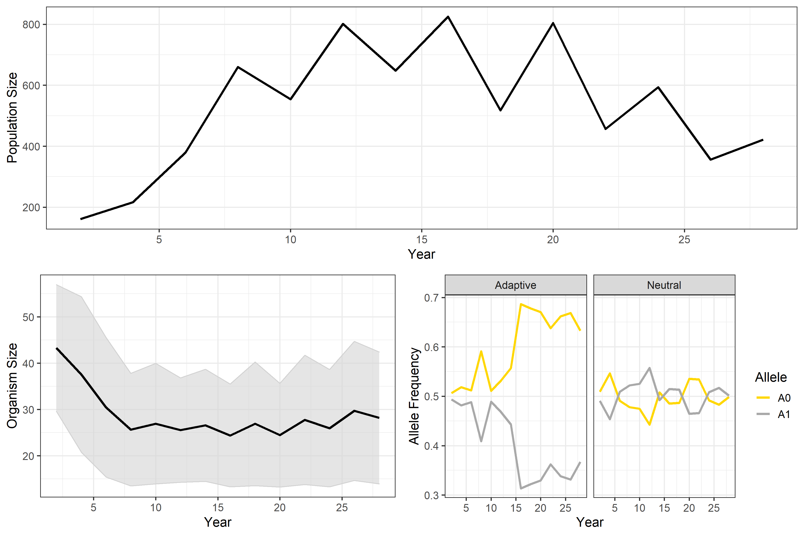

#### _Tutorial Contributors: Travis Seaborn, Erin Landguth_
Welcome to the CDMetaPOP tutorial! This release includes installation instructions, version notes, some examples, and technical documentation. CDMetaPOP is an individual-based, eco-evolutionary model for spatially-explicit simulation of population viability in landscape demogenetics. This tutorial will walk you through running CDMetaPOP, and then visualizing some of the outputs.

The goal of this tutorial is to introduce you to running CDMetaPOP and visualizing some of the outputs in R. Please see the following manual for a full explanation of input files and methodologies for the various modules within CDMetaPOP. The tutorial files are set up to run for 30 years, with a the climate (and increased mortality) updating at year 15. This will change the growth rates by using the temperature-dependent growth module in CDMetaPOP, in addition to increasing the mortality at these patches for individuals without a single allele which confers thermal tolerance.

*By the end of the tutorial, you should be able to:
1) Run CDMetaPOP
2) Import the outputs into R
3) Summarize the outputs of the simulations
4) Visualize population size, average size of an individual, and the allele frequencies related the locus under selection and a neutral locus.

_Important tutorial note: we are not running any sort of burn in or testing to see if the system has gone to equilibrium meaning we ran the model for long enough. These are important considerations when running simulations._
  
#### Repository contents
Included in this release are the following:
src -> CDMetaPOP source files
doc -> README.txt, user manual, history, and disclaimer
data -> test example files

#### Requirements and Pre-requisite Software
CDMetaPOP requires the Python2.7.x interpreter, NumPy package, and SciPy package. Remember that Python modules usually require particular Python interpreters, so be sure the version ID for any external Python module or package (e.g. NumPy or others) matches the version of your Python interpreter (normally v2.7.x). To avoid Python installation errors, we highly recommend installing Python from any number of the freely available bundlers, e.g., Canopy, ActiveState, Anaconda.

#### CDMetaPOP v1.0 Installation
Linux or Windows: Installation is done by unpacking the CDMetaPOP Archive. Navigate to the directory on your PC where you wish to install CDMetaPOP, and unpack the supplied zip archive file using a free archive tool like 7Zip (7z.exe), Pkunzip, Unzip, or an equivalent. Seven-Zip (7Z.exe) is highly recommended since it can handle all common formats on Windows, MAC OS X and Linux. 

On Windows, it is best to setup a project specific modeling subdirectory to perform your modeling outside of any folder that has spaces in its name (like "My Documents").

#### CDMetaPOP Example: Inputs
The example run is for 7 patches representing an effective distance matrix calculated using a least-cost path algorithm through riverine distance. We will be using the files with '_tut' in their name, for 'tutorial'. For additional examples of inputs, see the various files each directory within the './data' directory

Double check that the 3 directories provided in the archive (data, doc, src) are in the same directory and that you are in the correct directory on your computer.


##### There are multiple input files:
1. Population Variables and Settings ('PopVars_tut.csv'): The included file ‘PopVars_tut.csv’ in the data directory specifies the parameters that can be changed and used in our sample CDMetaPOP run. Open this file in your editor of choice. A spreadsheet program, like Microsoft Excel, allows for easy editing of the tabular values. There will be 3 lines of information in ‘PopVars.csv’: a header line and 2 lines of information corresponding to 2 separate CDMetaPOP runs (batch process). See Table 1 in user manual which contains a breakdown for each column header and the parameters that can be changed. The ‘Input’ in the table listed is for the first row in the file. Make sure you save this file in the same format – a comma delimited file – when you make changes to the parameters. Do not change the ‘Input’ (first row) labeling. Select ‘Yes’ or ‘OK’ for any Excel questions about saving in this format.

The file ‘PopVars_tut.csv’ defines the patch files in the first column and settings across the simulated landscape. The included files ‘PatchVars_tut.csv’ will also be in the directory (./data).

For additional examples of inputs, see ‘PopVars.csv’.


2. Patch Variables and Settings ('PatchVars_tut.csv'): Input file for patch level controls. An easy way to create this file is to establish first X,Y locations for each patch and develop raster surfaces for each variable (temperature, grow days, fitness values, and mortality values linked to climate or harvesting spatially). Then use a software program (‘raster’ in R or ArcGIS) to extract variables under each X,Y patch location, such as temperature

‘ClassVars.csv’ and 'allelefrequency.csv' files are specified in the ‘PatchVars.csv’ file and examples will be in the ./data/classvars/ and ./data/genes/ directories.


3. Class Variables and Settings ('Classvars_tut.csv'): Input file for variables that will vary with age/stage.


4. Allele Frequencies ('allelefrequency_tut.csv'): Input file created for initializing allele frequencies.

5. Patch Variable Distance Matrix ('Cdmatrix_tut.csv'): File that describes the connectivity of the patches. Multiple inputs are allowed, and the type of values should be specified within the 'PopVars.csv' file. For example, you may have a probability of dispersal matrix or a matrix of resistance values.


#### CDMetaPOP Exampling: Running Simulations
If you use python from the command line, then open a terminal window and change your shell directory to the CDMetaPOP src home directory after you have unzipped the files.

For example:
```shell
cd C:\directory\CDMetaPOP-master-fresh-pub\src
```

Next, run the program: There are a number of ways to run this program. If you are using a command shell you can run the program by typing “python CDMetaPOP.py C:/”homedirectorylocation”/data PopVars.csv output_test”.

```shell
python CDMetaPOP.py ../data/ PopVars_tut.csv tutorial_output
```

Note that there are 5 arguments here that must be included with spaces in between: 

1)	“python” starts python, for example from the command line. Note that other python environments may have different calls here. In PyLab (the IDE distributed with Canopy), the call is “run”. 

2)	“CDMetaPOP.py” runs CDMetaPOP program.

3) “../data/” is the directory location of the input tutorial files. You can point this directory to other project files, for example. We suggest not having any spaces in your directory names. So as projects accumulate you can rename input folders that contain the project specific files (e.g., dataWestslope or dataBullTrout).

4) “PopVars_tut.csv” is the parameter file (comma delimited) which can be renamed (e.g., “PopVars_WCT.csv”). Caution should be taken when going between operating systems and saving this file as a .csv.

5) “tutorial_output” is the name of the directory that will be created with CDMetaPOP output in the directory specified by the third argument above.

#### Check for successful model run completion 
The program will provide step-by-step output in the Shell window. Once completed, a simulation time will be printed out and folders batchrun0mcrun0, batchrun0mcrun1, batchrun0mcrun2, batchrun1mcrun0, and batchrun2mcrun0 will be created in your CDMetaPOP home directory to store output from the separate batch and/or Monte-Carlo runs (each line in the PopVars file corresponds to a separate batchrun and the specified ‘mcruns’ for each batch). These folders are located in the data folder specified in above step. The output folder will have a unique date/time stamp after the name of the output folder in case you want to run multiple CDMetaPOP runs in this same directory. The program will also provide a log file with program steps in your specified output directory. If parameters are such that population becomes extinct before specified generation time, then program will end. The program will provide error and feedback for parameters that are outside of ranges or incorrectly entered.

#### Importing data to R
There are multiple ways to handle the outputs of CDMetaPOP. For the purposes of this tutorial, we are going to input the outputs that write to you drive as "indXX.csv", where XX is the year being output. The number of years the simulations run, and which years are output, can be set using the 'PopVars' file.

First, load in the tidyverse package to help with data wrangling and visualization. We are also going to use cowplot to combine our plots.

```r
library(tidyverse)
library(cowplot)
```

Set directory to where your outputs are (assuming you have already moved R to your './data' directory from above), then load in the rows of every csv file and do some initial clean up.

```r
setwd('tutorial_output1625784394') #your exact numbers will vary (see manual)

#create a dataframe of every individual, by pulling in all of the outputs created after running CDMetaPOP
data_df = list.files(pattern = paste("ind*", sep=''), #this is the pattern for pulling in files
                          full.names = TRUE, 
                          recursive = TRUE, 
                          include.dirs = TRUE) %>% 
  map_df(function(x) read_csv(x, col_types = cols(.default = "c")) %>% mutate(filename=paste(dirname((x)),basename(x),sep="/")))
  
#you might not always want the full directory, but I've shown it here in case you are running replicates or need to keep track of the batches

#break up the column with the file name to delineate the year of the output
data_df <- separate(data = output_files, col = filename, into = c('junk', 'junk1', 'year'), sep = "/")
data_df <- separate(data = data_df, col = year, into = c('junk2', 'year'), sep = "d")
data_df <- separate(data = data_df, col = year, into = c('year', 'junk3'), sep = ".c")

#set column data types after you remove columns that we do not want. You will likely want different sets of columns depending on your research question.

data_df$junk <- NULL
data_df$junk1 <- NULL
data_df$junk2 <- NULL
data_df$junk3 <- NULL

data_df$ID <- NULL
data_df$sex <- NULL
data_df$mature <- NULL
data_df$newmature <- NULL
data_df$layeggs <- NULL
data_df$capture <- NULL
data_df$infection <- NULL
data_df$Hindex <- NULL
data_df$Species <- NULL
data_df$recapture <- NULL
data_df$SubPatchID <- NULL
data_df$CDist <- NULL
data_df$ClassFile <- NULL

data_df$L0A0 <-  as.numeric(data_df$L0A0)
data_df$L0A1 <- as.numeric(data_df$L0A1)
data_df$L1A0 <-  as.numeric(data_df$L1A0)
data_df$L1A1 <- as.numeric(data_df$L1A1)
data_df$size <- as.numeric(data_df$size)
data_df$age <- as.numeric(data_df$age)
data_df$year <- as.numeric(data_df$year)
data_df$XCOORD <- as.numeric(data_df$XCOORD)
data_df$YCOORD <- as.numeric(data_df$YCOORD)

#one last clean up step: removing the initialization individuals (year == -1) and year 0 individuals

data_df <- data_df %>%
  filter(year != "-1" & year != "0")
```

#### Summarizing the outputs
Now that we have our dataframe, where each individual is a row, we are ready to summarize what is happening during the simulation. The first summary we might want to know is the total number of individuals. Here we are not grouping by the PatchID, but you might want to do that for your analysis.

```r
pop_df <- data_df %>%
  group_by(year, .drop = FALSE) %>% #we use .drop = FALSE here in case some years don't have any individuals, but we still want that data point for plotting
  summarise(pop = n())
```

The next piece on our checklist was to look for differences in size. We are going to calculate the mean and standard deviation of the size column through time. Note: you could do some of this internally in ggplot, but I prefer to keep it outside.

```r
size_df <- data_df %>%
  group_by(year, .drop = FALSE) %>%
  summarize(average = mean(size), stdev = sd(size))
```

Next, we are going to calculate the proportion of the adaptive allele (allele "A" in our case) of the locus under selection and the A allele for a neutral locus. L0 is the locus under selection and L1 is our neutral locus. These are established through 'PatchVars.csv'; see that input file for the increased mortality of Aa and aa genotypes after the climate change step. Below, A0 would be "A" and A1 would be "a".

For a full description of locus and allele naming conventions, please see the manual. But briefly, L0A1 would represent the first locus and the first allele "A" in the 'PatchVars.csv' file.

First, the neutral locus:
```r
L1_df <- data_df %>%
  group_by(year, .drop = FALSE) %>%
  summarise_at(vars(L1A0:L1A1), sum, na.rm = TRUE)

#add in population so we can focus on allele frequencies
L1_df <- merge(L1_df, pop_df, by="year")

#because individuas are diploid, we need multiple the population by 2 to get allele frequency
L1_df$total <- (L1_df$pop * 2)

#we can now remove the population count
L1_df$pop <- NULL

#gathering the columns of alleles
L1_df_gathered <- gather(L1_df, key = "Allele", counts, L1A0:L1A1)
```

Now we are going to do the same thing but with the L0 locus (the one under selection). There is one additional step here, where we will add in the neutral locus

```r
L0_df <- data_df %>%
  group_by(year, .drop = FALSE) %>%
  summarise_at(vars(L0A0:L0A1), sum, na.rm = TRUE)

#add in population so we can focus on allele frequencies
L0_df <- merge(L0_df, pop_df, by="year")

#because individuas are diploid, we need multiple the population by 2 to get allele frequency
L0_df$total <- (L0_df$pop * 2)

#we can now remove the population count
L0_df$pop <- NULL

#gathering the columns of alleles
L0_df_gathered <- gather(L0_df, key = "Allele", counts, L0A0:L0A1)

#combine, and then calculate proportion
allele_freq_df <- rbind(L0_df_gathered, L1_df_gathered)
allele_freq_df$freq <- allele_freq_df$counts/allele_freq_df$total

#next, break up the full allele name so that we have an allele and a locus column
allele_freq_df <- separate(allele_freq_df, col = Allele, into = c('Locus', 'Allele'), sep = 2)

#lastly, rename the loci to match what they are
allele_freq_df$Locus <- as.factor(allele_freq_df$Locus)
levels(allele_freq_df$Locus) <- c("Adaptive", "Neutral")
```

#### Vizualization of Summary Tables
Next, we are going to create three figures and then combine them. The first figure will be a line graph of the population trend; the second will be the sizes; the third will be the allele proportions.

_Organism size is a little weird below due to not running any sort of burn in period._

```r
pop_plot <- ggplot(pop_df, aes(x = year, y = pop)) + 
  geom_line(color = "black", size = 1.2) +
  xlab("Year") +
  ylab("Population Size") +
  scale_x_continuous(n.breaks = 7) +
  theme_bw(base_size = 14)
  
size_plot <- ggplot(size_df, aes(x = year, y = average)) + 
  geom_ribbon(aes(ymin=average-stdev, ymax=average+stdev), fill="lightgray", color="lightgray", alpha=.6) +
  geom_line(color = "black", size = 1.2) +
  xlab("Year") +
  ylab("Organism Size") +
  scale_x_continuous(n.breaks = 7) +
  theme_bw(base_size = 14)
  
allele_plot <- ggplot(allele_freq_df, aes(x = year, y = freq, color = Allele)) + 
  geom_line(size = 1.2) +
  facet_wrap(~Locus) +
  scale_color_manual(values = c("gold", "darkgrey"))+
  xlab("Year") +
  ylab("Allele Frequency") +
  scale_x_continuous(n.breaks = 7) +
  theme_bw(base_size = 14)  
  
#first we are going to combine the bottom section
bottom <- plot_grid(size_plot, allele_plot, ncol = 2)
complete <- plot_grid(pop_plot, bottom, ncol = 1)

#last, save the plot
ggsave("CDMetaPOP_tutorial_output.png", plot = complete,
       width = 30, height = 20, units = "cm")
```  
#### Below you can see the final output from the tutorial data
<center>

</center> 

This gives us a summary of a couple of things that might be of interest to us from our simulation parameters. Feel free to reach out if you have general tutorial questions or want to see this expanded: tseaborn at uidaho.edu.
